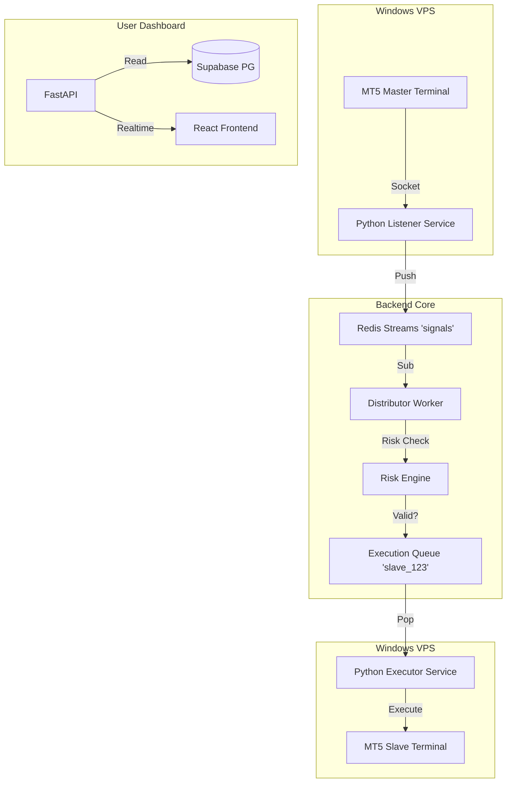

# Trade Copier: Technical Architecture & Layout

**Status**: Development Blueprint
**Ref**: Builds upon `trade_copier_proposal.md`

This document serves as the implementation guide for developers, defining the System Architecture, Data Logic, and Component Layouts.

---

## 1. System Architecture: The "Synapse" Engine

### High-Level Data Flow
We utilize a **Microservices-style** approach where the "Listener" is decoupled from the "Executor" via Redis.



### Component Roles

1.  **Listener Service (`/backend/services/listener.py`)**:
    -   Connects to MT5 Terminal instances using `MetaTrader5` lib.
    -   Polls internal state every 10ms (quasi-realtime).
    -   Pushes standardized JSON to Redis Stream `signals:incoming`.
2.  **Distributor Worker (`/backend/workers/distributor.py`)**:
    -   Consumes `signals:incoming`.
    -   Queries `copier_bindings` table to find all slaves attached to this master.
    -   Runs `RiskCheck(signal, binding_config)`.
    -   If Safe: Enqueues job to `queue:execution:{slave_id}`.
    -   If Risk Fail: Logs to `audit_logs` and discards.
3.  **Executor Service (`/backend/workers/executor.py`)**:
    -   Dedicated process per Slave Account (or pooled).
    -   Processes `queue:execution:{slave_id}`.
    -   Calculates Lot Size (Risk Multiplier Logic).
    -   Sends order to Slave MT5.
    -   Updates Supabase `trades` table with result.

---

## 2. Database Schema (Supabase)

### A. Accounts Table (`trading_accounts`)
Stores credentials for unconnected MT5 instances.
| Column | Type | Description |
| :--- | :--- | :--- |
| `id` | UUID | PK |
| `user_id` | UUID | FK -> auth.users |
| `type` | Enum | 'MASTER', 'SLAVE' |
| `broker` | String | Broker Name |
| `login` | String | MT5 Login ID |
| `password` | String | AES-256 Encrypted Password |
| `server` | String | Broker Server Address |
| `is_active` | Bool | Connection status |

### B. Copier Bindings (`copier_bindings`)
Defines the "Contract" between a Slave and a Master.
| Column | Type | Description |
| :--- | :--- | :--- |
| `id` | UUID | PK |
| `user_id` | UUID | Owner of the slave |
| `master_id` | UUID | FK -> trading_accounts |
| `slave_id` | UUID | FK -> trading_accounts |
| `risk_type` | Enum | 'FIXED_LOT', 'MULTIPLIER', 'EQUITY_RATIO' |
| `risk_value` | Float | e.g. 0.5 (Half size), 2.0 (Double size) |
| `force_min_lot` | Float | Floor value (e.g. 0.01) |
| `force_max_lot` | Float | Ceiling value (Safety) |
| `reverse_mode` | Bool | True = Invert Buys/Sells |
| `is_active` | Bool | Paused/Running |

### C. Trade Log (`copied_trades`)
The Ledger of Truth.
| Column | Type | Description |
| :--- | :--- | :--- |
| `id` | UUID | PK |
| `binding_id` | UUID | FK -> copier_bindings |
| `master_ticket` | Int | Original Ticket ID |
| `slave_ticket` | Int | New Ticket ID |
| `symbol` | String | 'EURUSD' |
| `latency_ms` | Int | Time from Signal to Execution |
| `slippage_points`| Int | Difference in Entry Price |
| `profit` | Float | Realized P/L |
| `status` | Enum | 'OPEN', 'CLOSED', 'FAILED' |

---

## 3. Frontend Architecture (React/Vite)

### Module Layout
All Copier components reside in `src/components/dashboard/copier/`.

```
src/components/dashboard/copier/
├── CopierStats.tsx        # High-level metrics (Total Profit, Active Copiers)
├── MasterMarketplace.tsx  # Grid of available Strategy Providers
├── ActiveBindings.tsx     # List of current connections (Master -> Slave)
├── binding-card/          # Visual card for a connection
│   ├── LatencyGraph.tsx   # Sparkline of speed
│   └── RiskControls.tsx   # Slider for Multiplier
├── logs/
│   └── TradeHistoryTable.tsx # Detailed datatable
└── wizards/
    └── ConnectAccountDialog.tsx # Multi-step form for MT5 Login
```

### Detailed Flow: The "Create Binding" Wizard
**Scenario**: User wants to follow "Gold King" with their "MyFunds" account.
1.  **Step 1**: Select Master. (API: `GET /masters`)
2.  **Step 2**: Select Slave. (API: `GET /accounts?type=slave`)
3.  **Step 3**: Risk Configuration.
    -   *UI*: Slider for "Multiplier" (0.1x to 10x).
    -   *Checkbox*: "Reverse Copying?"
    -   *Input*: "Stop Loss Override" (e.g. 50 pips).
4.  **Step 4**: Confirm.
    -   *Action*: `POST /copier/bindings`.
    -   *Backend*: Validates, Creates DB Entry, Notifies Distributor to reload cache.

---

## 4. API Endpoints (FastAPI)

### User Endpoints (`/api/v1/copier`)
-   `GET /bindings`: List all active/paused copies.
-   `POST /bindings`: Create new copy relationship.
-   `PATCH /bindings/{id}`: Update risk settings (Hot swap).
-   `POST /bindings/{id}/pause`: Emergency Kill Switch.
-   `GET /stats`: Aggregate P/L, Win Rate.

### Admin Endpoints (`/api/v1/admin/copier`)
-   `GET /global-risk`: View total exposure per symbol.
-   `POST /masters/{id}/ban`: Shadow ban a toxic master.
-   `GET /audit-logs`: Searchable logs for dispute resolution.

---

## 5. Security & Risk Logic Specification

### The "Reverse Copy" Algorithm
If `binding.reverse_mode === true`:
1.  **Signal**: Master BUY EURUSD @ 1.0500.
2.  **Inversion**: Transform to SELL.
3.  **Price Check**:
    -   Master entered at Ask (1.0500).
    -   Slave must Sell at Bid. Current Bid = 1.0498.
    -   Spread Loss = 2 points.
    -   *Logic*: If `(Bid - Ask)` > `MaxSpreadThreshold`, **WAIT**.
4.  **TP/SL Mirror**:
    -   Master TP: 1.0550 (+50 pips).
    -   Slave TP: 1.0450 (-50 pips).
    -   *Formula*: `SlaveTP = EntryPrice - (MasterTP - MasterEntry)`.

### The "Equity Shield" Job
Background Task (run every 1 min):
1.  Loop through all `trading_accounts`.
2.  Check `equity`.
3.  If `equity < protection_floor`:
    -   Fire `CLOSE_ALL_POSITIONS`.
    -   Set `is_active = False`.
    -   Send Email Alert.
